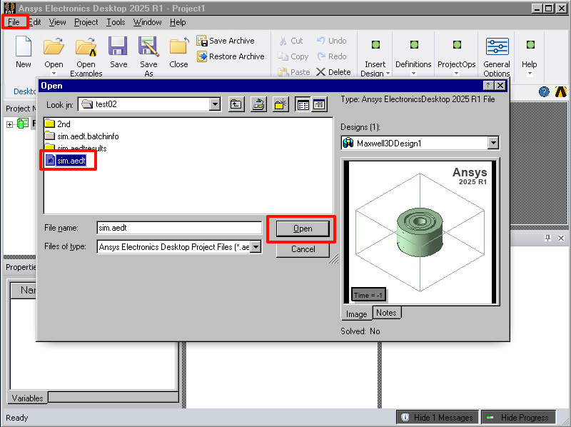
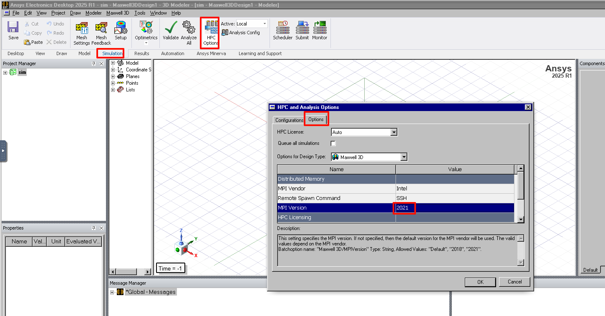
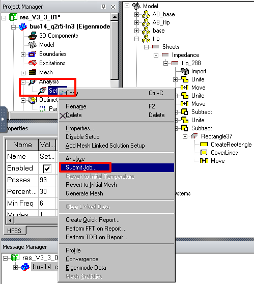
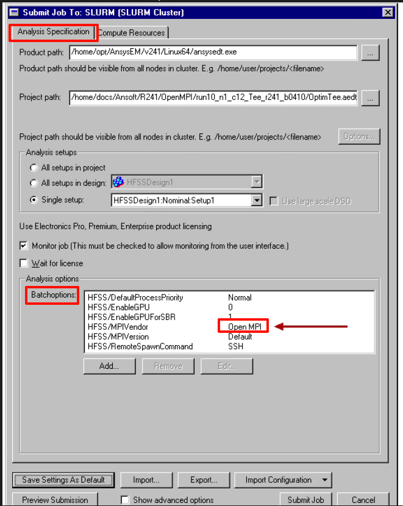
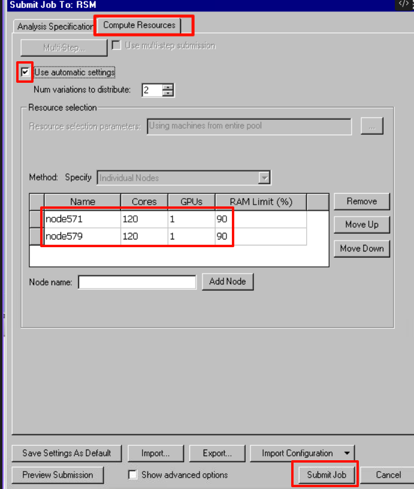
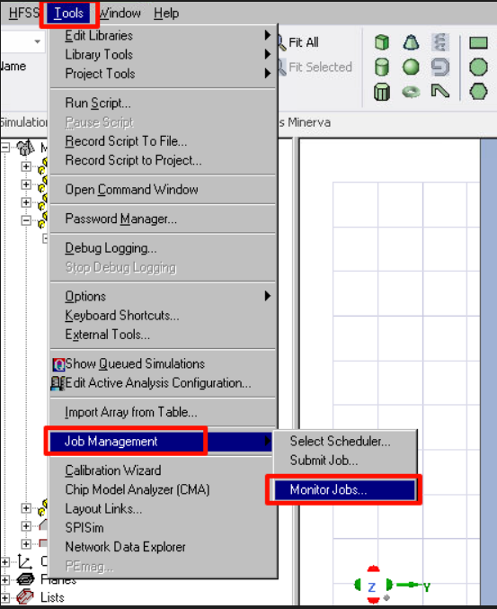
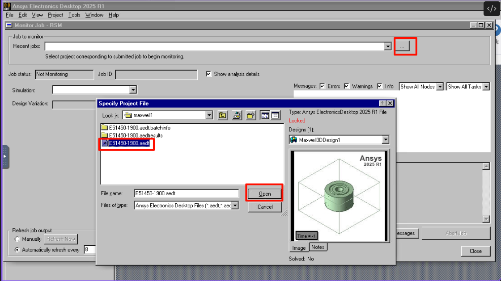
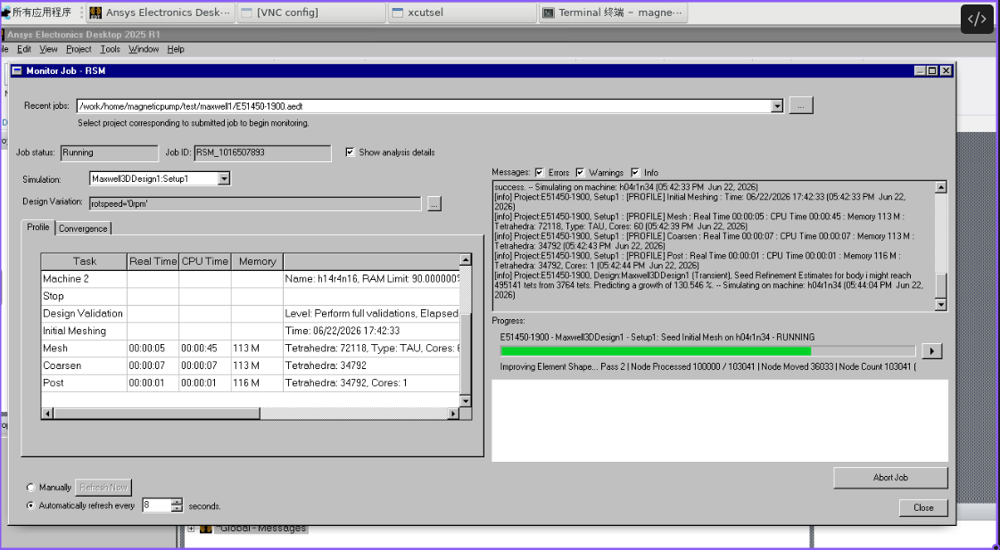
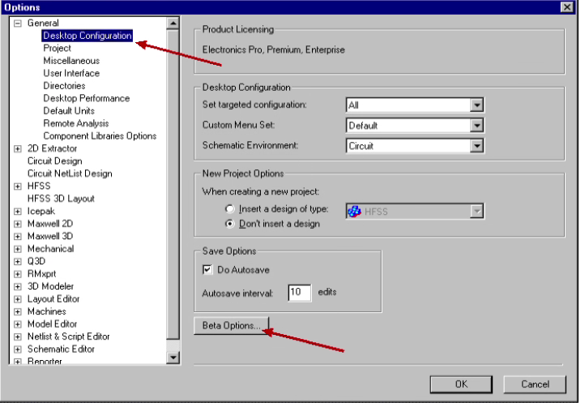
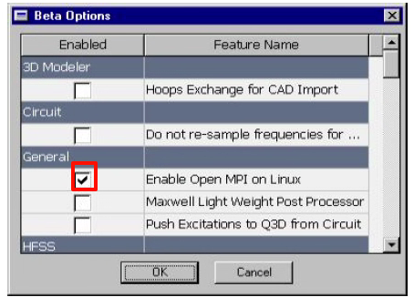

[TOC]

 <!-- 强制分页 -->

---
# 图形
## 图形计算设置
### 导入算例  

点击左侧的`File`按钮，`Open`选中`.aedt`文件打开

### 并行设置
设置`Intelmpi`为`2021`

设置成功可以在提交作业的[Batchoptions](#font2)里查看

!!! tip
    `IntelMPI 2021`可以在高版本`glibc`上使用，默认是`2018`在武汉、青海等集群上就默认用不了，或者设置成`OpenMPI`，也可以使用，但需要[开启Beat功能](#font1)

 <!-- 强制分页 -->

### 提交作业
点开左侧项目数，`Analysis`下右键`Setup1`,点击`Submit Job`

`Analysis Specification`下`Batchoptions`会打印当前使用的`MPI`信息

点击`Compute Resources`，勾选上`automatic settings`，设置好节点和核心数，`Submit Job`提交作业

提交成功之后作业界面会被关闭

 <!-- 强制分页 -->

### 监控作业
`Tools` > `Job Management` > `Monitor Jobs`

选中正在计算的`.aedt`文件打开，会打印出作业运行的相关日志

等待日志结束，作业完成后，再重新打开[导入算例](#font0)查看

### 补充 
#### 开启`Beat`，切换至`OpenMPI` 

`Tools > Options > General Options`

 <!-- 强制分页 -->