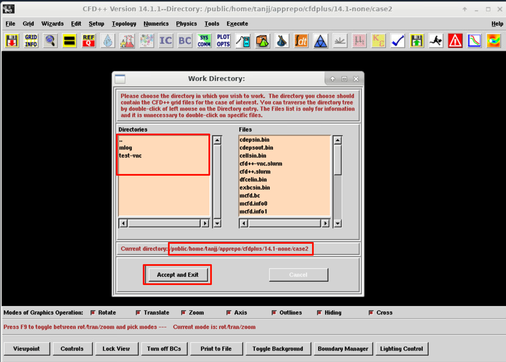
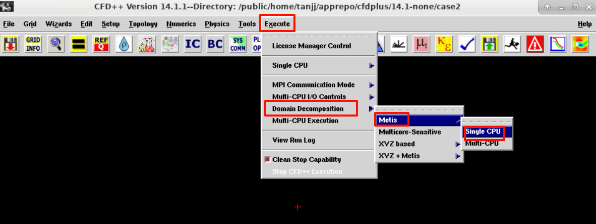
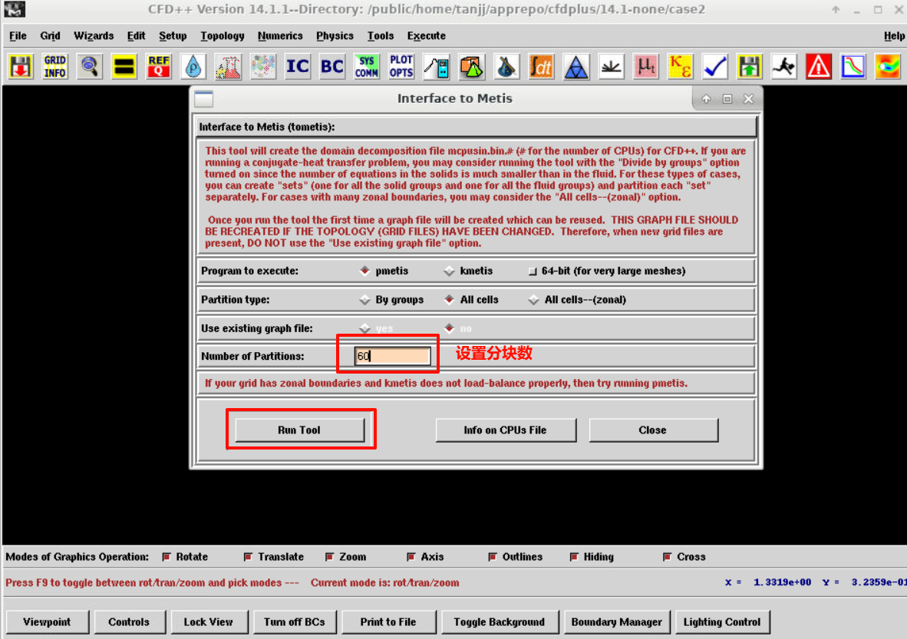
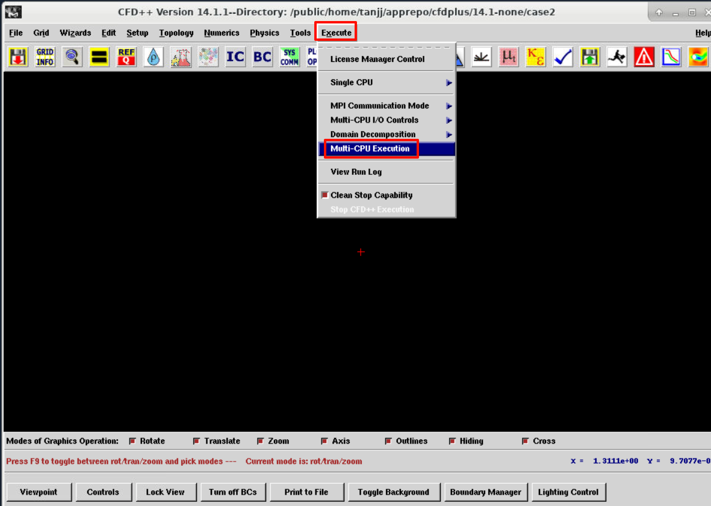
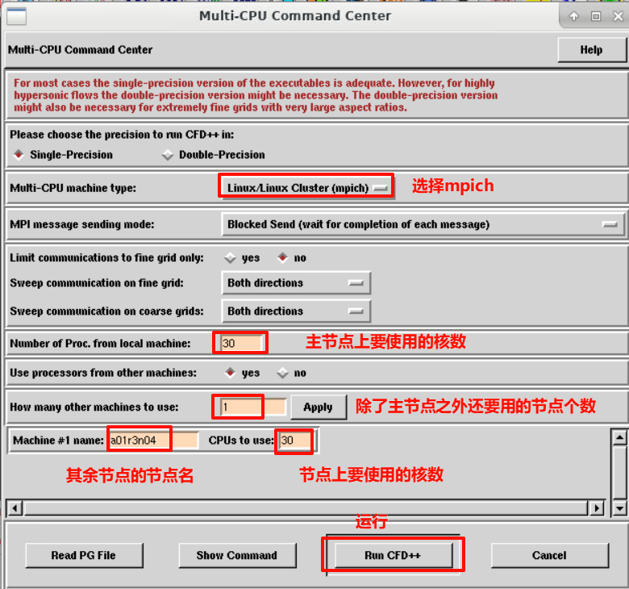

[TOC]

---
# 图形
## 启动脚本示例

```bash
#!/bin/bash                       
#SBATCH -J cfd++               #指定作业名称
#SBATCH -p kshcnormal           #指定队列/分区名称
#SBATCH -N 2                 #指定节点数
#SBATCH --ntasks-per-node=32        #指定每节点的任务数量

# 环境加载
module purge
module load compiler/devtoolset/7.3.1    mpi/mpich/3.3.2-gcc-7.3.1
source /public/home/tanjj/apprepo/cfdplus/14.1-none/scripts/env.sh
export MPI_REMSH=rsh
ulimit -s unlimited
ulimit -l unlimited

# 图形投射
export DISPLAY=vncserver04:18

# 图形程序启动
/public/home/tanjj/apprepo/cfdplus/14.1-none/app/mlib/mcfd.14.1/exec/mcfdgui

sleep 10000
```

!!! tip
    1. 图形脚本计算`linux`版本只能走`mpich`并行
    2. 创建一个`rsh`软连接，`ln -s /usr/bin/ssh /pathto/xxx/rsh`，然后将`export PATH=/pathto/xxx:$PATH`写入到`~/.bashrc`
    3. `cfd++`的启动环境也需要写到`~/.bashrc`

## 图形计算设置
### 算例设置
#### 导入算例文件
点击左侧的`Directory`窗口，切换至算例所在目录，点击`Accept and Exit`载入算例


!!! tip
    可以选择不`display the Grid Boundaries`

#### 网格划分
点击`Execute --> Domain Decomposition --> Metis --> Single CPU`


设置网格分块数与并行进程一致，点击`Run Tool`,会弹出运行日志框


网格分块成功后，算例目录下会输出`mcpusin.bin.分块数`文件，没输出就是失败了，原因结合日志分析

!!! tip
    1. 网格划分建议走单核<br>
    2. 划分失败若是因内存问题，可以调大启动软件环境里的`MCFD_PROCMEM`和`MCFD_MAXMEM`的内存[配置](#font)

### 并行设置
#### 界面参数设置
点击`Execute  --> Multi-CPU Execution


设置并行参数，点击`Run CFD++`，开始计算，会弹出运行日志框，运行识别结合日志分析


!!! tip
    1. `Multi-CPU machine type`选择为`Linux/Linux Cluster(mpich)`
    2. 默认是用主节点的的核数并行，跨节点则需要另外添加其余的节点名和并行核数
    3. 若因内存问题，可以调大启动软件环境里的`MCFD_PROCMEM`和`MCFD_MAXMEM`的内存[配置](#font)

### 启动环境内存解释<div id="font"></div>

- **`MCFD_MAXMEM`**
单个运行实例可使用的最大总内存上限  限制整个计算任务的内存使用总量，防止系统过载

- **`MCFD_PROCMEM`**
每个MPI进程的最大内存分配限额  在并行计算中控制单个进程的内存使用

- **`MCFD_SPROCMEM`**
和 MCFD_PROCMEM 一样，优先级更高

- **`MCFD_PPROCMEM`**
每个MPI进程的物理内存分配限制 

详细见手册

!!! tip
    自带手册打开方式:
    ```bash
    export DISPLAY=vncserver02:14
    cd /pathto/cfdplus/14.1-none/app/mlib/mcfd.14.1/html/
    firefox index3.html
    ```
    
