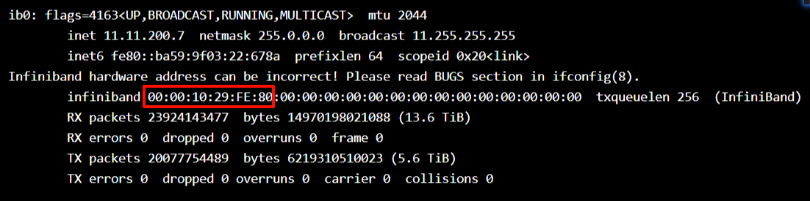
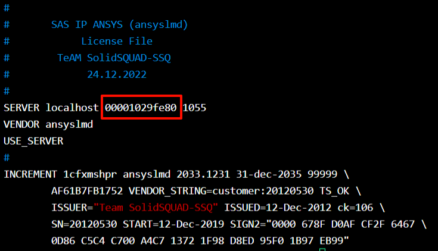

[TOC]

<div style="page-break-after: always;"></div> <!-- 强制分页 -->

---
# license服务启动
## ANASYS
`ANASYS`系列`licesne`服务针对`2023R1`及以上版本都通用，包括`ANASYS`全家桶`Fluent`、`WorkBench`、`HFSS`等皆可以共用一套`license`服务
### license服务启动流程
#### 工具安装
切换至软件安装包路径,可以提前将本体的几个安装包合并到一个目录下
```bash
$ ls
231-1.dvd    anssh.ini                          cads           corewb         engdata             fluentc   hlp          lmcenter    nohup.out          sgcharts
231-2.dvd    ansys                              ccm            cpythcloudext  ensight             fluentm   icemcfd      lsdyna      optislang          shapeoptimization
231-3.dvd    ANSYS.2023.R1.Product.Linux64.iso  cff            cpythext       ensight_components  fluentp   icemwb       manifest    package.id         solver
aas          apdl                               cfx            cpythnew       fensap              fluents   icepak       mechsrvplg  polyflow           speoshpc
acp          apipsrv                            cfxcomon       data           fluent2d            fluentu   INSTALL      meshing     post               syscplg
addincfg     aqwa                               chemkin        designmodeler  fluent2ddp          forte     instcore     mono        pyprime            tp
addins       autodyn                            clclient       distcomp       fluent3d            framewrk  license      motion      python_site_mapdl  turbogrd
additive_cl  blademodeler                       common         dpf            fluent3ddp          fwgfx     LICENSE.TXT  mw          rsm                util
anscust      builddate.txt                      commoninstall  ecadxltr       fluenta             geompara  licserv      nexus       sec                wbonebld
```
```bash
chmod +x INSTALL
$ ./INSTALL -silent -LM -install_dir /Pathxxx/license
# -silent 静默安装
# -LM 指定只安装 licens 管理器
# -install_dir 指定安装路径
```
<div style="page-break-after: always;"></div> <!-- 强制分页 -->

#### 服务启动
安装完成后，切换到`shared_files/licensing`目录下，将[配置](#font1)好的`ansyslmd.lic`复制到`license_files`目录下
```bash
$ cd /Pathxxx/license/shared_files/licensing
$ ls
ansysli_data  gatherdiagnostics  init_ansyslm_tomcat  lic_admin      linx64       prodord        start_lmcenter  stop_lmcenter
ansys_pid     init_ansysli       language             license_files  logs_backup  start_ansysli  stop_ansysli    tools
```
启动服务
```bash
$ ./start_ansysli 
```
确认服务启动可以检查端口或者看目录下的日志文件
```bash
$ lsof -i:1055 
COMMAND    PID     USER   FD   TYPE    DEVICE SIZE/OFF NODE NAME
lmgrd    19385 jsyadmin    0u  IPv6 655429743      0t0  TCP *:ansyslmd (LISTEN)
lmgrd    19385 jsyadmin    7u  IPv6 655429767      0t0  TCP localhost:ansyslmd->localhost:53678 (ESTABLISHED)
ansyslmd 19387 jsyadmin    0u  IPv6 655429743      0t0  TCP *:ansyslmd (LISTEN)
ansyslmd 19387 jsyadmin   14u  IPv4 655400650      0t0  TCP localhost:53678->localhost:ansyslmd (ESTABLISHED)

$ tail -n 10  license.log 
15:24:57 (ansyslmd) Listener Thread: running
15:40:28 (ansyslmd) OUT: "cfd_solve_level2" jsyadmin@a09r4n01  [32206] 
15:40:28 (ansyslmd) OUT: "cfd_solve_level1" jsyadmin@a09r4n01  [32206] 
15:40:28 (ansyslmd) OUT: "cfd_base" jsyadmin@a09r4n01  [32206] 
15:40:54 (ansyslmd) IN: "cfd_solve_level1" jsyadmin@a09r4n01  [32206] 
15:40:54 (ansyslmd) IN: "cfd_base" jsyadmin@a09r4n01  [32206] 
15:40:54 (ansyslmd) IN: "cfd_solve_level2" jsyadmin@a09r4n01  [32206] 
15:42:36 (ansyslmd) OUT: "cfd_solve_level2" jsyadmin@login09  [10711] 
15:42:36 (ansyslmd) OUT: "cfd_solve_level1" jsyadmin@login09  [10711] 
15:42:37 (ansyslmd) OUT: "cfd_base" jsyadmin@login09  [10711] 
```
!!! tip
    1.提前做好爱国版本操作
    2.想停止服务可以`./stop_ansysli`,或者直接杀掉所有相关进程

<div style="page-break-after: always;"></div> <!-- 强制分页 -->

#### 获取服务
第一种方式是通过环境变量获取
```bash
export ANSYSLMD_LICENSE_FILE=1055@a09r4n01
```
第二种方式可以直接在安装目录下写好配置文件
```bash
cd /PathToAnsys/shared_files/licensing/
touch ansyslmd.ini
echo 'SERVER=1055@a09r4n01' >> ansyslmd.ini
```

<div style="page-break-after: always;"></div> <!-- 强制分页 -->

#### ansyslmd.lic文件配置<div id="font1"></div>
一般安装包里会有`license.txt`文件，复制一份成`ansyslmd.lic`即可，需要修改所起服务的端口以及网卡地址，端口选一个没有被占用的就行，默认的`1055`也可以，网卡地址可以使用`ifconfig`查询，一般选择一个`ib`网卡的
```bash
$ ifconfig 
```



!!! tip
    1.网卡地址选择前12位置小写
    2.`localhost`可以改成服务所起在的机器名，如果改为机器名，就只能在该机器上启动服务，当然保持`localhost`也可以

<div style="page-break-after: always;"></div> <!-- 强制分页 -->

## ABAQUS
### 